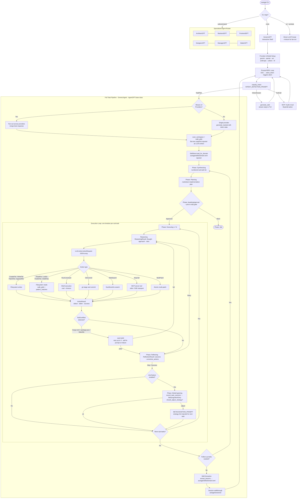

# 🤖 GenericGPT Interactive Mode

GenericGPT is a production-hardened autonomous software engineering agent with session persistence, model switching, and multi-provider support.

When you run `autogpt` with **no subcommand or flags**, it launches an interactive AI TUI powered by GenericGPT:

```sh
autogpt
```

<video src="https://github.com/user-attachments/assets/6aae0f5e-1137-4866-bc86-8a081ce067c4"></video>

The interactive shell supports the following commands:

| Command         | Description                                                              |
| --------------- | ------------------------------------------------------------------------ |
| `<your prompt>` | Send a task to the GenericGPT autonomous agent                           |
| `/help`         | Show available commands                                                  |
| `/provider`     | Switch AI provider (Gemini, OpenAI, Anthropic, XAI, Cohere, HuggingFace) |
| `/models`       | Browse and switch between provider-native models                         |
| `/sessions`     | List and resume previous sessions                                        |
| `/status`       | Show current model, provider, and directory                              |
| `/workspace`    | Show the current workspace path                                          |
| `/clear`        | Clear the terminal                                                       |
| `exit` / `quit` | Save session and quit                                                    |

> Press `ESC` at any time to interrupt a running generation.

## 🔀 Mixture of Providers (MoP)

AutoGPT introduces a high-availability **Mixture of Providers** architecture. When enabled via the `--mixture` or `-m` flag, every prompt is fanned out concurrently to all configured AI providers (Gemini, OpenAI, HuggingFace, etc.). A weighted scoring engine evaluates responses based on:

1. **Length calibration** (rewarding detail, penalizing fluff).
1. **Code quality** (bonus for language-tagged Markdown blocks).
1. **Structural richness** (headings, lists, hygiene).
1. **Reasoning depth** (connectivity words and logical flow).
1. **Completeness** (punctuation and closing delimiters).

The highest-scored response is selected as the winner and injected into the agent's context, promoting the best "intelligence" available from your configured keys.

## The `.autogpt` Directory

GenericGPT maintains all persistent state inside the workspace root (defaults to the **current directory**):

```sh
.autogpt/
├── sessions/          # Markdown conversation snapshots, auto-saved after every response
│   ├── <uuid>.md
│   └── ...
└── skills/            # TOML lesson files, injected into future prompts automatically
    ├── rust.toml
    ├── web.toml
    └── python.toml
```

Control the workspace root with `AUTOGPT_WORKSPACE`:

```sh
export AUTOGPT_WORKSPACE=/my/project   # scope all file ops to a specific directory
autogpt
```

## Model Selection

Models are sourced dynamically from each provider's crate. Override the active model without entering the shell:

```sh
export GEMINI_MODEL=gemini-2.5-pro-preview-05-06
export OPENAI_MODEL=gpt-4o
export MODEL=<any-model-id>    # global fallback for any provider
```

## How GenericGPT Works

Each prompt travels through a multi-phase pipeline, with every phase reflected live in the terminal UI:

1. **Intent Detection**: The agent reads your message and decides whether it can answer directly, call a specific tool, or needs to plan and execute a full multi-step task.
1. **Multi-Provider Fan-out**: When mixture mode is enabled, the prompt is sent to all configured AI providers simultaneously and the best response is selected.
1. **Task Synthesis**: The agent breaks your goal down into a concrete, numbered list of actionable sub-tasks.
1. **Implementation Plan**: A structured plan is generated and displayed, giving you a clear overview of what will be built before execution begins.
1. **Reasoning**: Before tackling each sub-task, the agent thinks through its approach, anticipated risks, and the best execution strategy.
1. **Execution**: The agent carries out the sub-task by performing file operations, running shell commands, searching the web, calling external tools, and more, atomically and in order.
1. **Build & Verify**: If a buildable project is detected, the agent automatically compiles or runs it and attempts to self-correct any failures, retrying up to three times.
1. **Reflection**: After completing each sub-task, the agent reviews its own output and decides whether to accept it, retry with corrections, or skip and move on.
1. **Metacognition**: The agent tracks outcome patterns across tasks. When it detects repeated failures or inefficiencies, it recalibrates its strategy for the remaining work.
1. **Skill Extraction**: At the end of a session, the agent distills domain-specific lessons from what worked and stores them for automatic reuse in future sessions on similar topics.


