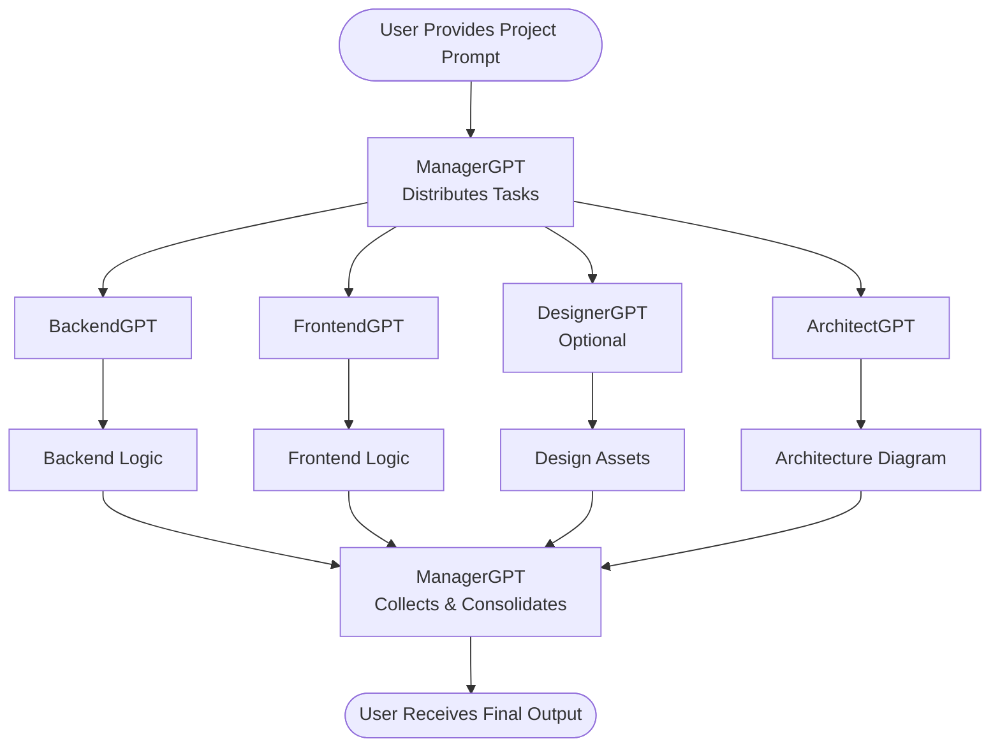
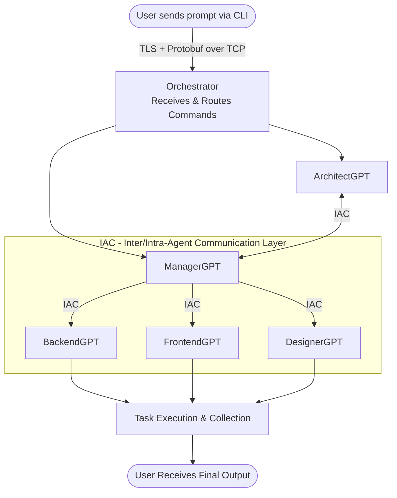

<div align="center">

# 🤖 AutoGPT

[](https://github.com/wiseaidev)
[](https://www.rust-lang.org/)
[](https://www.rust-lang.org)
[](LICENSE)
[](https://github.com/wiseaidev)
[](https://jupyter.org/)

[](https://reddit.com/submit?url=https://github.com/wiseaidotdev/autogpt&title=World%27s%20First%2C%20Multimodal%2C%20Zero%20Shot%2C%20Most%20General%2C%20Most%20Capable%2C%20Blazingly%20Fast%2C%20and%20Extremely%20Flexible%20Pure%20Rust%20AI%20Agentic%20Framework.)
[](https://news.ycombinator.com/submitlink?u=https://github.com/wiseaidotdev/autogpt&t=World%27s%20First%2C%20Multimodal%2C%20Zero%20Shot%2C%20Most%20General%2C%20Most%20Capable%2C%20Blazingly%20Fast%2C%20and%20Extremely%20Flexible%20Pure%20Rust%20AI%20Agentic%20Framework.)
[](https://twitter.com/share?url=https://github.com/wiseaidotdev/autogpt&text=World%27s%20First%2C%20Multimodal%2C%20Zero%20Shot%2C%20Most%20General%2C%20Most%20Capable%2C%20Blazingly%20Fast%2C%20and%20Extremely%20Flexible%20Pure%20Rust%20AI%20Agentic%20Framework.)
[](https://www.facebook.com/sharer/sharer.php?u=https://github.com/wiseaidotdev/autogpt)
[](https://www.linkedin.com/shareArticle?url=https://github.com/wiseaidotdev/autogpt&title=World%27s%20First%2C%20Multimodal%2C%20Zero%20Shot%2C%20Most%20General%2C%20Most%20Capable%2C%20Blazingly%20Fast%2C%20and%20Extremely%20Flexible%20Pure%20Rust%20AI%20Agentic%20Framework.)

[](https://dl.circleci.com/status-badge/redirect/gh/wiseaidotdev/autogpt/tree/main)
[](https://crates.io/crates/autogpt)
[](./examples/basic.ipynb)
[](https://mybinder.org/v2/gh/wiseaidotdev/autogpt/main?filepath=examples/basic.ipynb)
[](https://colab.research.google.com/github/wiseaidotdev/autogpt/blob/main/examples/basic.ipynb)


|                                                    🐧 Linux `(Recommended)`                                                    |                                                           🪟 Windows                                                           |                                                          🐋                                                          |                                                          🐋                                                          |
| :----------------------------------------------------------------------------------------------------------------------------: | :----------------------------------------------------------------------------------------------------------------------------: | :------------------------------------------------------------------------------------------------------------------: | :------------------------------------------------------------------------------------------------------------------: |
|              [](https://crates.io/crates/autogpt)               |              [](https://crates.io/crates/autogpt)               | [](https://hub.docker.com/r/kevinrsdev/autogpt) | [](https://hub.docker.com/r/kevinrsdev/orchgpt) |
|                          |                      |                                                          -                                                           |                                                          -                                                           |
|         Method 1: [Download Executable File](https://github.com/wiseaidotdev/autogpt/releases/download/v0.4.3/autogpt)         |              [Download `.exe` File](https://github.com/wiseaidotdev/autogpt/releases/download/v0.4.3/autogpt.exe)              |                                                          -                                                           |                                                          -                                                           |
|                                        Method 2: `cargo install autogpt --all-features`                                        |                                             `cargo install autogpt --all-features`                                             |                                           `docker pull kevinrsdev/autogpt`                                           |                                           `docker pull kevinrsdev/orchgpt`                                           |
| [**Set Environment Variables**](https://github.com/wiseaidotdev/autogpt/blob/main/INSTALLATION.md#environment-variables-setup) | [**Set Environment Variables**](https://github.com/wiseaidotdev/autogpt/blob/main/INSTALLATION.md#environment-variables-setup) |   [**Set Environment Variables**](https://github.com/wiseaidotdev/autogpt/blob/main/INSTALLATION.md#-using-docker)   |   [**Set Environment Variables**](https://github.com/wiseaidotdev/autogpt/blob/main/INSTALLATION.md#-using-docker)   |
|                                                 `autogpt -h` <br> `orchgpt -h`                                                 |                                                        `autogpt.exe -h`                                                        |                                          `docker run kevinrsdev/autogpt -h`                                          |                                          `docker run kevinrsdev/orchgpt -h`                                          |

<video src="https://github.com/user-attachments/assets/6aae0f5e-1137-4866-bc86-8a081ce067c4"></video>

</div>

> [!NOTE]
> This project is under active development. There is also a parallel project, [**lmm**](https://github.com/wiseaidotdev/lmm), under equally active development; It does **not** use LLMs at all. Instead, it uses equation-based intelligence to predict new words and reason without gradient-trained models. Check it out if you're interested in a fundamentally different approach to machine intelligence!

AutoGPT is a pure rust framework that simplifies AI agent creation and management for various tasks. Its remarkable speed and versatility are complemented by a mesh of built-in interconnected GPTs, ensuring exceptional performance and adaptability.

## 🧠 Framework Overview

AutoGPT agents are modular, autonomous, and designed for flexibility:

- 🔌 **Tools & Sensors**: Interface with the real world via actions (e.g., file I/O, APIs) and perception (e.g., audio, video, data).
- 🧠 **Memory & Knowledge**: Combines long-term vector memory with structured knowledge bases for reasoning and recall.
- 📝 **No-Code Agent Configs**: Define agents and their behaviors with simple, declarative YAML, no coding required.
- 🧭 **Planner & Goals**: Breaks down complex tasks into subgoals and tracks progress dynamically.
- 🧍 **Persona & Capabilities**: Customizable behavior profiles and access controls define how agents act.
- 🧑‍🤝‍🧑 **Collaboration**: Agents can delegate, swarm, or work in teams with other agents.
- 🪞 **Self-Reflection**: Introspection module to debug, adapt, or evolve internal strategies.
- 🔄 **Context Management**: Manages active memory (context window) for ongoing tasks and conversations.
- 🔌 **MCP (Model Context Protocol)**: First-class support to seamlessly connect external tool servers (Stdio, SSE, HTTP) to extend capabilities.
- 📅 **Scheduler**: Time-based or reactive triggers for agent actions.
- 🧪 **Custom Agent Creation**: Build tailored agents for different roles or domains.
- 📋 **Task Orchestration**: Manage and distribute tasks across agents efficiently.
- 🧱 **Extensibility**: Add new tools, behaviors, or agent types with ease.
- 💻 **CLI Tools**: Command-line interface for rapid experimentation and control.
- 🧰 **SDK Support**: Embed AutoGPT into existing projects or systems seamlessly.
- 🔀 **Mixture of Providers (MoP)**: Parallel fan-out and weighted scoring across multiple AI backends for optimal response quality.

## 📦 Installation

Please refer to [our tutorial](INSTALLATION.md) for guidance on installing, running, and/or building the CLI from source using either Cargo or Docker.

> [!NOTE]
> For optimal performance and compatibility, we strongly advise utilizing a Linux operating system to install this CLI.

## 🔄 Workflow

AutoGPT supports 4 modes of operation: interactive, direct prompt, standalone agentic, and distributed agentic.

### 0. 🤖 GenericGPT Interactive Mode (Default)

When you run `autogpt` with **no subcommand or flags**, it launches an interactive AI TUI powered by **GenericGPT**, a production-hardened autonomous software engineering agent. GenericGPT features intent detection, a complete seven-step reasoning and execution pipeline, automatic build-and-verify loops, and metacognition for learning across tasks.

```sh
autogpt
```

<video src="https://github.com/user-attachments/assets/6aae0f5e-1137-4866-bc86-8a081ce067c4"></video>

> [!NOTE]
> For an in-depth breakdown of how GenericGPT works under the hood, including its architecture, interactive shell, Mixture of Providers (MoP), and execution pipeline, see the [GenericGPT Documentation](GenericGPT.md).

### 1. 💬 Direct Prompt Mode

<video src="https://github.com/user-attachments/assets/505737f6-2fe8-4a93-8cd9-fb036b55b8fd"></video>

In this mode, you can use the CLI to interact with the LLM directly, no need to define or configure agents. Use the `-p` flag to send prompts to your preferred LLM provider quickly and easily. Combine with `--mixture` to get the best answer from all your providers at once.

```sh
# Single provider
autogpt -p "Explain the Rust borrow checker in simple terms"

# Mixture of Providers (fanned out)
autogpt -m -p "Implement a Red-Black tree in Rust"
```

### 2. 🧠 Agentic Networkless Mode (Standalone)

<video src="https://github.com/user-attachments/assets/7d47b1d8-b2f2-4d23-a1f4-da926e425330"></video>

In this mode, the user runs an individual `autogpt` agent directly via a subcommand (e.g., `autogpt arch`). Each agent operates independently without needing a networked orchestrator.



- ✍️ **User Input**: Provide a project's goal (e.g. "Develop a full stack app that fetches today's weather. Use the axum web framework for the backend and the Yew rust framework for the frontend.").
- 🚀 **Initialization**: AutoGPT initializes based on the user's input, creating essential components such as the `ManagerGPT` and individual agent instances (ArchitectGPT, BackendGPT, FrontendGPT).
- 🛠️ **Agent Configuration**: Each agent is configured with its unique objectives and capabilities, aligning them with the project's defined goals.
- 📋 **Task Allocation**: ManagerGPT distributes tasks among agents considering their capabilities and project requirements.
- ⚙️ **Task Execution**: Agents execute tasks asynchronously, leveraging their specialized functionalities.
- 🔄 **Feedback Loop**: Continuous feedback updates users on project progress and addresses issues.

### 3. 🌐 Agentic Networking Mode (Orchestrated)

<video src="https://github.com/user-attachments/assets/ecd82549-a48f-49c2-b751-23f74820bf3d"></video>

In networking mode, `autogpt` connects to an external orchestrator (`orchgpt`) over a secure TLS-encrypted TCP channel. This orchestrator manages agent lifecycles, routes commands, and enables rich inter-agent collaboration using a unified protocol.

AutoGPT introduces a novel and scalable communication protocol called [`IAC`](IAC.md) (Inter/Intra-Agent Communication), enabling seamless and secure interactions between agents and orchestrators, inspired by [operating system IPC mechanisms](https://en.wikipedia.org/wiki/Inter-process_communication).



All communication happens securely over **TLS + TCP**, with messages encoded in **Protocol Buffers (protobuf)** for efficiency and structure.

1. **User Input**: The user provides a project prompt like:

   ```sh
   /arch create "fastapi app" | python
   ```

   This is securely sent to the Orchestrator over TLS.

1. **Initialization**: The Orchestrator parses the command and initializes the appropriate agent (e.g., `ArchitectGPT`).

1. **Agent Configuration**: Each agent is instantiated with its specialized goals:
   - **ArchitectGPT**: Plans system structure
   - **BackendGPT**: Generates backend logic
   - **FrontendGPT**: Builds frontend UI
   - **DesignerGPT**: Handles design

1. **Task Allocation**: `ManagerGPT` dynamically assigns subtasks to agents using the IAC protocol. It determines which agent should perform what based on capabilities and the original user goal.

1. **Task Execution**: Agents execute their tasks, communicate with their subprocesses or other agents via IAC (inter/intra communication), and push updates or results back to the orchestrator.

1. **Feedback Loop**: Throughout execution, agents return status reports. The `ManagerGPT` collects all output, and the Orchestrator sends it back to the user.

## 🤖 Available Agents

At the current release, AutoGPT consists of 9 built-in specialized autonomous AI agents ready to assist you in bringing your ideas to life!
Refer to [our guide](AGENTS.md) to learn more about how the built-in agents work.

## 📌 Examples

Your can refer to [our examples](EXAMPLES.md) for guidance on how to use the cli in a jupyter environment.

## 📚 Documentation

For detailed usage instructions and API documentation, refer to the [AutoGPT Documentation](https://docs.rs/autogpt).

## 🤝 Contributing

Contributions are welcome! See the [Contribution Guidelines](CONTRIBUTING.md) for more information on how to get started.

## 📝 License

This project is licensed under the MIT License - see the [LICENSE](LICENSE) file for details.
