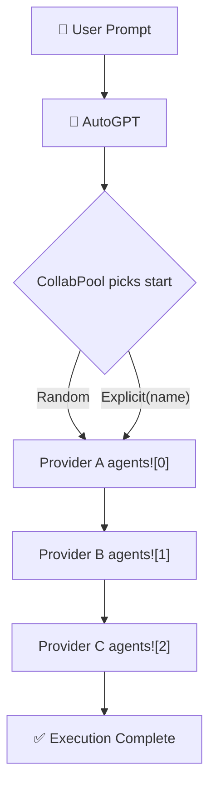

# 🤝 Collaborative Multi-Provider Agents (`col`)

The **`col`** feature adds [`CollabPool`]: a provider routing registry that enables `AutoGPT` to execute agents sequentially across multiple LLM providers in round-robin order.

## Overview



- **Library usage** (`col` only): `CollabPool::from_providers(names)`: pure routing, no API keys required at build time.
- **CLI/TUI usage** (`col + cli`): `CollabPool::from_env()`: auto-discovers all providers with API keys set, spawns one `GenericAgent` per provider.

## SDK Usage

Enable the feature in `Cargo.toml`:

```toml
[dependencies]
autogpt = { version = "0.4.5", features = ["col", "gem"] }
```

All collab types are available via the prelude:

```rust
use autogpt::prelude::*;  // imports CollabPool, CollabSelection
```

### `CollabPool::from_providers`

Build a lightweight routing pool from a list of provider names: no agents or API keys required:

```rust
let pool = CollabPool::from_providers(vec![
    "gemini".to_string(),
    "openai".to_string(),
    "anthropic".to_string(),
]);

println!("{} providers", pool.len());
println!("start at: {}", pool.provider_name(pool.pick_start(&CollabSelection::Random)));
```

### Attaching a Pool to `AutoGPT`

Pass the pool to `AutoGPT::with_collab_pool()`. The orchestrator uses the pool to determine execution order when `run()` is called:

```rust
use autogpt::prelude::*;

#[tokio::main]
async fn main() {
    let pool = CollabPool::from_providers(vec![
        "gemini".to_string(),
        "openai".to_string(),
    ]);

    let agent_a = ArchitectGPT::new("Architect", "Design a task management system.").await;
    let agent_b = ArchitectGPT::new("Architect", "Design a task management system.").await;

    let autogpt = AutoGPT::default()
        .with(agents![agent_a, agent_b])
        .with_collab_pool(pool)
        .build()
        .expect("Failed to build AutoGPT");

    autogpt.run().await.unwrap();
}
```

### `CollabSelection`

| Variant                           | Behaviour                             |
| --------------------------------- | ------------------------------------- |
| `CollabSelection::Random`         | Picks a random start index            |
| `CollabSelection::Explicit(name)` | Always starts from the named provider |

### API Reference

| Method                              | Description                                     |
| ----------------------------------- | ----------------------------------------------- |
| `CollabPool::from_providers(names)` | Build a routing pool from provider name strings |
| `pool.len()`                        | Number of providers in the pool                 |
| `pool.is_empty()`                   | `true` if no providers registered               |
| `pool.provider_name(idx)`           | Name of the provider at index `idx`             |
| `pool.pick_start(selection)`        | Returns starting index per `CollabSelection`    |
| `AutoGPT::with_collab_pool(pool)`   | Attach the pool to the orchestrator             |

## CLI / TUI Collab Mode (`col + cli`)

Enable collab in the TUI binary:

```sh
cargo run --features "cli,col,gem,oai,xai" --bin autogpt -- --collab
```

`from_env()` automatically discovers all providers whose API key is set:

| Provider    | Env Var             |
| ----------- | ------------------- |
| Gemini      | `GEMINI_API_KEY`    |
| OpenAI      | `OPENAI_API_KEY`    |
| Anthropic   | `ANTHROPIC_API_KEY` |
| XAI         | `XAI_API_KEY`       |
| Cohere      | `COHERE_API_KEY`    |
| HuggingFace | `HF_API_KEY`        |

### Fallback Behaviour

When a provider fails, the pool automatically falls back:

| Event                                | Action                                                |
| ------------------------------------ | ----------------------------------------------------- |
| Rate-limit / quota / 401 / 402 error | Rotate to provider's **next model** and retry         |
| All models for provider exhausted    | Remove provider; route to **next available provider** |
| All providers exhausted              | Log `⚠ All collab providers exhausted.`               |

The TUI shows `🤝` (start), `🔀` (fallback), and `⚠` (exhausted) log prefixes.

## See Also

- [CollabPool example](../../examples/collab-agent/)
- [Metacognition](./metacognition.md)
- [Feature Flags](./feature-flags.md)
