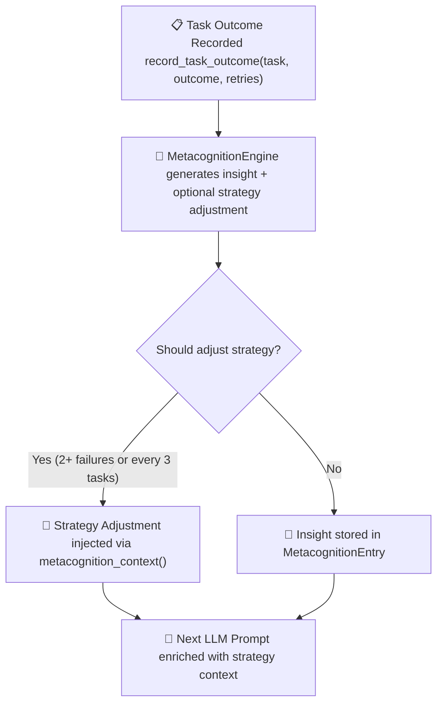

# 🧠 Agent Metacognition (`mta`)

The **`mta`** feature embeds a [`MetacognitionEngine`] inside every [`AgentGPT`]. It records task outcomes, generates per-task insights, and injects a strategy context string into subsequent LLM prompts, enabling agents to self-correct based on past performance.

## Overview



> In the TUI/CLI (`GenericAgent`), the engine fires automatically every 3 tasks or after 2+ consecutive failures. The TUI status bar shows **MetaCognizing** during this phase.

## SDK Usage

Enable the feature in `Cargo.toml`:

```toml
[dependencies]
autogpt = { version = "0.4.5", features = ["mta", "gem"] }
```

All metacognition types are available via the prelude:

```rust
use autogpt::prelude::*;  // imports MetacognitionEngine, MetacognitionEntry
```

### Recording Task Outcomes

```rust
use autogpt::prelude::*;

#[tokio::main]
async fn main() {
    let mut agent = AgentGPT::new_borrowed("Research Analyst", "Summarise papers.");

    // Record task outcomes. Returns a MetacognitionEntry with insight + optional strategy.
    let entry = agent.record_task_outcome("parse pdf", "success", 0);
    println!("Insight: {}", entry.insight);

    let entry = agent.record_task_outcome("extract methodology", "failed", 2);
    println!("Insight : {}", entry.insight);
    if let Some(adj) = &entry.strategy_adjustment {
        println!("Strategy: {adj}");
    }

    // Check aggregate state.
    println!("Should adjust?       {}", agent.should_adjust_strategy());
    println!("Consecutive failures: {}", agent.consecutive_failures());

    // The full context string injected into the next LLM prompt.
    println!("{}", agent.metacognition_context());
}
```

### API Reference

| Method                                              | Returns              | Description                            |
| --------------------------------------------------- | -------------------- | -------------------------------------- |
| `agent.record_task_outcome(task, outcome, retries)` | `MetacognitionEntry` | Record and analyse a task result       |
| `agent.metacognition_context()`                     | `String`             | LLM-injectable strategy context string |
| `agent.should_adjust_strategy()`                    | `bool`               | `true` when engine recommends a change |
| `agent.consecutive_failures()`                      | `u32`                | Count of consecutive failing tasks     |

### `MetacognitionEntry`

```rust
pub struct MetacognitionEntry {
    pub task: String,
    pub outcome: String,       // "success" | "failed"
    pub retries: u8,
    pub insight: String,       // generated by the engine
    pub strategy_adjustment: Option<String>,
}
```

## GenericAgent Integration (`mta + cli`)

When both `mta` and `cli` features are enabled, `GenericAgent` triggers metacognition automatically during the task reflection phase:

```sh
cargo run --features "cli,mta,gem" --bin autogpt
```

**Trigger conditions** (any one):

- Every **3 completed tasks**.
- After **2+ consecutive failures**.

When triggered, the agent sends a structured metacognition prompt to the LLM to derive strategy adjustments for remaining tasks. The TUI status bar transitions to **MetaCognizing** during this phase, then reverts to **Working** when complete.

## Running with AutoGPT

Metacognition data is recorded on the `AgentGPT` level and is available after `AutoGPT::run()` completes if you hold a reference to the agent:

```rust
use autogpt::prelude::*;

#[tokio::main]
async fn main() {
    let persona = "Research Analyst";
    let behavior = "Summarise and extract insights from research papers.";

    // Seed metacognition before run.
    let mut probe = AgentGPT::new_borrowed(persona, behavior);
    probe.record_task_outcome("previous task", "failed", 1);
    println!("Context: {}", probe.metacognition_context());

    let agent = ArchitectGPT::new(persona, behavior).await;

    AutoGPT::default()
        .with(agents![agent])
        .build()
        .expect("Failed to build AutoGPT")
        .run()
        .await
        .unwrap();
}
```

## See Also

- [Metacognition example](../../examples/metacognition-agent/)
- [Collaborative Agents](./collab.md)
- [Feature Flags](./feature-flags.md)
